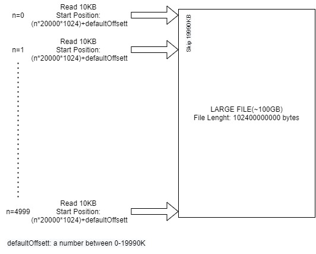

# storage-benchmark-go
A storage benchmark specifically developped for measuring read performance of large files from storage area networks in parallel

    Usage:
      storage-benchmark-go[options]

    Options:
      -filePath string 
          filePath for the read test. A file larger than 100GB is recommended. (default "256GB.dummy")
      -offsetOption int
          An optional offset number as number of chunks between 0-10000. Otherwise it is random (default -1)
      -parallelOption
          Optional parallel read flag.
      -h, --help 
          Show help and usage information

 ## Example Read Scenario on a 100GB File 
 
